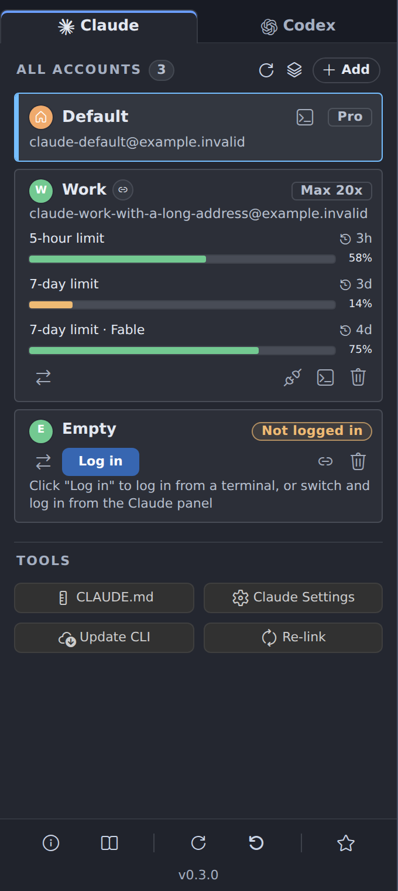
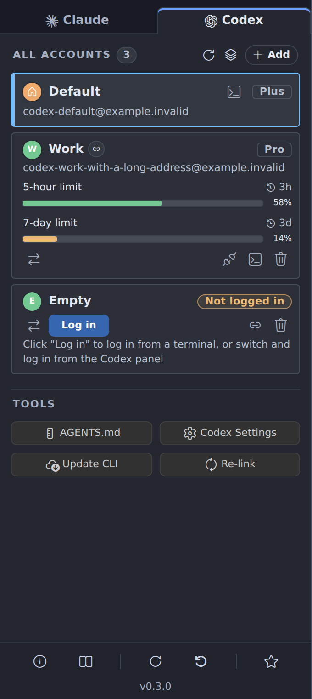

  

# PlanSwap: Claude Code & Codex Account Switcher

Switch between the Claude Code and Codex subscription accounts you own (Claude Pro / Max, ChatGPT Plus / Pro…) from a VS Code sidebar, without signing out and back in. Built for VS Code WSL remote windows and native Windows; local Linux desktops and other remote windows work too. macOS is not supported.

## Features

  
  

- **One sidebar, two tabs**: Claude and Codex accounts side by side, each with its email and plan.
- **Stay signed in everywhere**: sign in once per account, then switch with one click.
- **Linked or independent accounts**: share the default account's setup and history, or keep them separate.
- **Usage limits on every card**: what is left (or used) of each limit and when it resets, checked automatically or on demand.
- **Status bar summary**: `Claude 97% · Codex 82%`, turning yellow or red when a limit runs low.
- **Tools**: open your rules file and the official extension's settings, update the CLI, re-link accounts.
- **Five languages**: English, Simplified Chinese, Traditional Chinese, Spanish and Japanese.

Every setting is listed in the [user guide](docs/user-guide.md#change-language-and-display-settings).

## Requirements

- A VS Code 1.107+ compatible editor: VS Code, Antigravity IDE or VSCodium, in a WSL remote window, on native Windows, on a local Linux desktop or in another remote window.
- The official Claude Code and/or Codex extension installed where the window runs.
- The `claude` and/or `codex` command on the PATH there for terminal sign-in. Usage checks can also use the CLI bundled with the corresponding official extension when the command is unavailable.
- For Codex switching outside native Windows: Bash as the login shell.

## Supported editors

A Claude switch applies to new sessions; reload the window to move open panels over. A Codex switch needs a restart:

| Environment | After switching a Codex account |
| --- | --- |
| Antigravity IDE or VSCodium in WSL | PlanSwap restarts the WSL server after you confirm; reload each disconnected window. |
| VS Code in WSL | Close all VS Code windows of that distribution, then reopen them. |
| Native Windows | Fully quit the editor and start it again from the Start menu or taskbar. |
| Local Linux or other remote windows | Restart the editor or remote server as PlanSwap's instructions show. |

**Save your work before switching Codex accounts**: the restart closes integrated terminals and running CLI sessions. Step-by-step instructions: [user guide](docs/user-guide.md#select-an-account-and-apply-it).

## Install

Search for **PlanSwap** in the Extensions view of a **WSL window** (the extension runs on the WSL side) or a local Windows window, and click **Install**.

- VS Code: [Visual Studio Marketplace](https://marketplace.visualstudio.com/items?itemName=n2ns.planswap)
- Antigravity IDE, VSCodium: [Open VSX](https://open-vsx.org/extension/n2ns/planswap)

With a downloaded `.vsix` file, run **Extensions: Install from VSIX...** in the same kind of window instead.

## Quick start

Open **PlanSwap** in the activity bar. The `default` row is your existing account.

**Claude**

1. Click **+ Add**, type a name and press Enter. Keep **Link to the default account's settings and history** checked to reuse your setup.
2. Click the row's **Log in** button and sign in in the terminal.
3. Click the **Switch to this account** arrow icon and confirm.

**Codex**

1. On the Codex tab, click **Enable Codex switching** and confirm.
2. Add an account and sign in, as for Claude.
3. Switch to it and follow the [restart steps](#supported-editors) for your environment.

Signing in to a new account never signs out the others. The [user guide](docs/user-guide.md) covers every step in detail.

## Linked and independent accounts

| | Linked | Independent |
| --- | --- | --- |
| Settings, rules and skills | The default account's | A copy, changed separately |
| History and sessions | The default account's | Its own |
| Sign-in | Its own | Its own |

You can change an account's mode later, and **Re-link** in Tools brings linked accounts up to date after you change the default setup ([user guide](docs/user-guide.md#change-an-existing-account-mode)).

## Known limitations

- **Open sessions keep their account** until you reload (Claude) or restart (Codex).
- **Switching is not per window**: other windows of the same editor switch too.
- **Continuing another account's session can fail**, especially between Codex accounts in different ChatGPT organizations.
- **Some sign-ins apply to every account**, such as an `ANTHROPIC_API_KEY` in the environment; PlanSwap warns you ([details](docs/user-guide.md#sign-ins-that-apply-to-every-account)).
- **On Windows**, linking single files needs Developer Mode, and Codex thread databases stay per account ([details](docs/user-guide.md#linking-on-windows)).
- **Not yet verified everywhere**: switching has been tested end to end only in Antigravity IDE in WSL, and usage limits only with a default Claude account.

## Privacy

PlanSwap has no telemetry and makes no network requests of its own. Usage limits are read through the official `claude` and `codex` CLIs, which contact their own services as usual. PlanSwap never copies, moves or sends your sign-in credentials, and it changes your shell or environment configuration only after you confirm. Details: [privacy](docs/privacy.md).

## Uninstall

Before uninstalling PlanSwap:

1. Switch Claude back to `default` and reload the window.
2. If you enabled Codex switching, run **Codex Account: Disable Codex Account Switching** from the Command Palette to remove its shell configuration (on Windows, the user environment variable `CODEX_HOME`).
3. Uninstall PlanSwap from the Extensions view in the window where you installed it (WSL or Windows).

Your account directories (`~/.claude-<name>` and `~/.codex-<name>`) are kept. To clear PlanSwap's saved account list, display names and usage records as well, delete `~/.config/planswap/state.json`. This does not delete the accounts' own files.

## Documentation

- [User guide](docs/user-guide.md): step-by-step account setup, switching, usage limits, tools and troubleshooting.
- [Privacy](docs/privacy.md): what PlanSwap reads, stores, changes and sends.
- [Changelog](CHANGELOG.md): changes in each release.
- [Blog post](https://n2ns.com/blog/switch-claude-code-codex-accounts-planswap): why PlanSwap exists and how it switches accounts without copying or swapping credentials.

## Contributing

The [feature reference](docs/features.md) describes the detailed behavior of accounts, switching and panel tools.

## Disclaimer

PlanSwap is an independent community project and is not affiliated with, endorsed by, or sponsored by Anthropic or OpenAI.

## License

[MIT](LICENSE)

Built by [N2NS Lab](https://n2ns.com/), the open-source lab of [datafrog.io](https://datafrog.io/) for practical AI developer tools.
